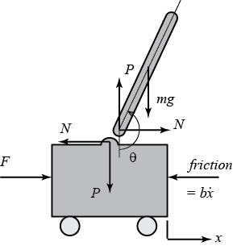

---
jupytext:
  formats: ipynb,md:myst
  text_representation:
    extension: .md
    format_name: myst
    format_version: 0.13
    jupytext_version: 1.15.2
kernelspec:
  display_name: Python 3 (ipykernel)
  language: python
  name: python3
---

# Péndulo invertido

Parámetros:

(M)       mass of the cart                         0.5 kg

(m)       mass of the pendulum                     0.2 kg

(b)       coefficient of friction for cart         0.1 N/m/sec

(l)       length to pendulum center of mass        0.3 m

(I)       mass moment of inertia of the pendulum   0.006 kg.m^2

(F)       force applied to the cart

(x)       cart position coordinate

(theta)   pendulum angle from vertical (down)

+++

## Esquema



+++

## Ecuaciones linealizadas

+++

$$
\left[{\begin{array}{c}
  \dot{x}\\ \ddot{x}\\ \dot{\phi}\\ \ddot{\phi}
\end{array}}\right] =
\left[{\begin{array}{cccc}
  0&1&0&0\\
  0&\frac{-(I+ml^2)b}{I(M+m)+Mml^2}&\frac{m^2gl^2}{I(M+m)+Mml^2}&0\\
  0&0&0&1\\
  0&\frac{-mlb}{I(M+m)+Mml^2}&\frac{mgl(M+m)}{I(M+m)+Mml^2}&0
\end{array}}\right]
\left[{\begin{array}{c}
  x\\ \dot{x}\\ \phi\\ \dot{\phi}
\end{array}}\right]+
\left[{\begin{array}{c}0\\
  \frac{I+ml^2}{I(M+m)+Mml^2}\\
  0 \\
  \frac{ml}{I(M+m)+Mml^2}
\end{array}}\right]u$$

$${\bf y} =
\left[{\begin{array}{cccc}
  1 & 0 & 0 & 0 \\
  0 & 0 & 1 &0
\end{array}}\right]
\left[{\begin{array}{c}
  x\\ \dot{x}\\ \phi\\ \dot{\phi}
\end{array}}\right]+
\left[{\begin{array}{c}
  0\\0
\end{array}}\right]u$$

```{code-cell} ipython3
import matplotlib.animation as animation
import numpy as np
import matplotlib.pyplot as plt
import control as ctrl
import random
```

```{code-cell} ipython3
M = 0.5
m = 0.2
b = 0.1
I = 0.006
g = 9.8
l = 0.3
p = I*(M+m)+M*m*l**2;
p
```

```{code-cell} ipython3
A = np.matrix([[0, 1, 0,0],
     [0, -(I+m*l**2)*b/p,  (m**2*g*l**2)/p, 0],
     [0, 0, 0,  1],
     [0, -(m*l*b)/p, m*g*l*(M+m)/p, 0]])

B =np.matrix([[0],
     [(I+m*l**2)/p],
          [0],
        [m*l/p]])

C = np.matrix([[1, 0, 0, 0],
     [0, 0, 1, 0]])

D = np.matrix([[0],
               [0]])

states = ['x', 'x_dot', 'phi', 'phi_dot']
inputs = ['u']
outputs = ['x', 'phi']

pendulo = ctrl.ss(A,B,C,D, states=states, inputs=inputs, outputs=outputs)
pendulo
```

```{code-cell} ipython3
ctrl.pzmap(pendulo)
```

## Modelo del sistema lineal usando NonlinearIOSystem

```{code-cell} ipython3
def pendulum_lin_derivs(t, x, u, params):
    # Parámetros, tienen valores por defecto
    M=params.get('M', 0.5)#kg
    m=params.get('m', 0.2)#kg
    b=params.get('b', 0.1)
    I=params.get('I', 0.006)
    g=params.get('g', 9.8)#m/s^2
    l=params.get('l', 0.3)#m
    
    p = I*(M+m)+M*m*l**2;
    
    # variables de estado
    pos       = x[0]#m
    vel       = x[1]#m/s
    theta     = x[2]#rad
    theta_dot = x[3]#rad/s
    
    # Cálculo de la acción de control
    F = u[0] #[N] if u[0] > 0 else 0 # solo caudales positivos

    #calculo de la derivada de x, x_dot, theta, theta_dot... dh/dt
    dpos       = vel+random.normalvariate(0,0.1) #x1_dot
    dvel       = -((I+m*l**2)*b/p)*vel+((m**2*g*l**2)/p)*theta+((I+m*l**2)/p)*F #dvel       = -.182*vel+2.67*theta+1.82*F#
    dtheta     = theta_dot
    dtheta_dot = -(m*l*b)/p*vel+m*g*l*(M+m)/p*theta+m*l/p*F    #dtheta_dot = -.455*vel+31.2*theta+4.55*F

    return np.array([dpos, dvel, theta_dot, dtheta_dot])

def pendulum_lin_outputs(t, x, u, params):
    "Las ecuaciones de las salida"
    return np.array([x[0],x[2]])#+random.normalvariate(0,0.001),x[2]+random.normalvariate(0,0.001)])

io_pendulum_lin = ctrl.NonlinearIOSystem(
    pendulum_lin_derivs, pendulum_lin_outputs, inputs=('u'), outputs=('x','phi'),
    states=('x','vel','phi','theta_dot'), name='pendulo_nolin')
```

## Diseño de la ley de control

Elegí lo polos lograr:

Ante un escalón de 0.2m en la posición del carro del péndulo. Bajo estas condiciones, se decide que el carro logre esta condición en un tiempo menor a 5 segundos y que tenga un tiempo de crecimiento por debajo de 0.5 segundos. También se desea que el pendulo logre la posición vertical en menos de 5 segundos, y ademas, el ángulo del pendulo no debe superar los 20 grados (0.35 radianes).

En resumen, los requerimientos de diseño para el pendulo invertido en espacio de estado ante un escalón de 0.2m, son:

1. Tiempo de establecimiento para $x$ y $\theta$ menor a 5 segundos
2. Rise time para $x$ menor a 0.5 segundos
3. Ángulo del pendulo $\theta$ no debe superar los 20 grados (0.35 radianes) de la vertical
4. El error de estado estacionario debe ser menor al 2% para $x$ y $\theta$

+++

Traduciendo las especificaciones a requerimientos:

1. Las especificaciones temporales $t_s$ y $t_r$, limitan el ancho de banda del sistema fijando requerimientos para $w_n$, por otro lado el ancho de banda del sistema esta limitado por el polo del sistema en el semi-plano derecho, $p= 5.56$, por lo que $w_c$ deberá ser mayor a $2p$, es decir, $w_c> 11.12$, que es mas restrictivo que los requerimientos de performance.
2. Que el ángulo sea menor que 0.35rad lo podemos usar para LQR
3. Por otro lado, los errores de estado estacionario imponen restricciones a la ganancia del sistema, que verificaremos al cerrar el lazo.
4. finalmente agrego una cota para el sobrepico para acotar el movimiento de $x$ y $\theta$

```{code-cell} ipython3
ts = 5 #[s]
tr = .5 #[s]

sigma=4/ts
wn=1.8/tr
wc=11.5

xi=.7

print('por ts wn > ', sigma/xi, ' por tr wn > ', wn, ' por wc > 2p, wc > ', wc)
```

```{code-cell} ipython3
wd= wc*np.sqrt(1-xi**2)
sigma = wc*xi

print(sigma)
p1 = -sigma + 1j*wd;
p2 = -sigma - 1j*wd;
p3 = -sigma*5;
p4 = -sigma*4;
p_obj1= [p1, p2, p3, p4]

print(p_obj1)
```

```{code-cell} ipython3
K1 = ctrl.place(A,B,p_obj1);
print(K1)
```

### Verificación de la ley de control

```{code-cell} ipython3
sys_cl1 = ctrl.ss(A-B*K1,B,C,0,);

sys_cl1.pole()
```

```{code-cell} ipython3
n = 1000
tf = 4
time = np.linspace(0,tf,n)

u = np.zeros(time.size)#np.ones(time.size)*.2
x0 = [0, 0, np.radians(2), 0]#[0, 0, 0, 0]#

t1,y1,x1 =ctrl.forced_response(sys_cl1,U=u,T=time,X0=x0,return_x=True)
x=y1[0,:];
theta_a=y1[1,:];

plt.plot(t1,x)#pos
plt.plot(t1,theta_a)#angulo en rad

plt.grid()
plt.xlabel('Time (sec)')
plt.ylabel('Angular Posición (rad)/ Posición (m)')
```

## Estimador total

```{code-cell} ipython3
m_obsv = ctrl.obsv(A,C)
print('\n')
rango_obsv = np.linalg.matrix_rank(m_obsv)
print(m_obsv)
print("Rango la matriz de observabilidad:",rango_obsv)
```

```{code-cell} ipython3
#5 veces respecto a los polos p_obj2
pe_obj1=p_obj1*np.array(5)
pe_obj1
```

```{code-cell} ipython3
L = ctrl.place(pendulo.A.T,pendulo.C.T,pe_obj1).T
L
```

```{code-cell} ipython3
 np.linalg.eigvals(A-L@C)
```

```{code-cell} ipython3
Ae=A-L@C-B@K1 #A*x_e-B*u-L(y-C*x_e)
Be=L#np.hstack([B,L]) 
Ce=-K1# u=-K*x_e
De=np.zeros([1,2])
Ae,Be,Ce,De
```

```{code-cell} ipython3
states = ['x_est', 'x_est_dot', 'phi_est', 'phi_est_dot']
inputs = ['x','phi']#la entrada y no puede ser de 2x1 tengo que separar
outputs = ['u']

#regulador con estimador total ley de control u=-k*x_est + estimador total
reg_est_tot = ctrl.ss(Ae,Be,Ce,De, states=states, inputs=inputs, outputs=outputs)
reg_est_tot
```

### Análisis del sistema controlado con ley de control y estimador

```{code-cell} ipython3
states = ['x_est', 'x_est_dot', 'phi_est', 'phi_est_dot']
inputs = ['x','phi']#la entrada y no puede ser de 2x1 tengo que separar
outputs = ['u_est']

#regulador con estimador total ley de control u=-k*x_est + estimador total
controlador = ctrl.ss(Ae,Be,Ce,De, states=states, inputs=inputs, outputs=outputs)
controlador
```

```{code-cell} ipython3
ctrl.pzmap(controlador)
```

Vemos que el controlador tiene 1 polo en C+

```{code-cell} ipython3
G_L = ctrl.interconnect([pendulo,controlador],inputs=['u'],outputs=['u_est'])
G_L = -G_L
ctrl.pzmap(G_L)
```

```{code-cell} ipython3
plt.figure()
m,p,w=ctrl.bode(G_L,dB=False,margins=True,omega_limits=[5,1000]);
```

gm :  Gain margin

pm :  Phase margin

sm :  Stability margin, the minimum distance from the Nyquist plot to -1

wpc : Phase crossover frequency (where phase crosses -180 degrees), which is associated with the gain margin.

wgc : Gain crossover frequency (where gain crosses 1), which is associated with the phase margin.

wms : Stability margin frequency (where Nyquist plot is closest to -1)

```{code-cell} ipython3
gm,pm,sm,wpc,wgc,wms=ctrl.stability_margins(G_L)
print('MG = ',gm,'MF',pm,'omega de corte = ',wpc,wgc)
```

```{code-cell} ipython3
plt.figure()
T = ctrl.feedback(G_L)
m,p,w=ctrl.bode(T,dB=False,margins=False);
ctrl.bandwidth(T)
```

```{code-cell} ipython3
plt.figure();
ctrl.nyquist(G_L);

plt.figure();
ctrl.nyquist(G_L,omega_limits=[8,1000])
```

En este caso el sistema es estable N= -2 y 2 polos en C+ P=2 por lo que Z=0 => es estable

```{code-cell} ipython3
plt.figure();
fig, ax = plt.subplots()
circle = plt.Circle((0, 0), 1, color='r', fill=False)
ax.plot(np.real(G_L(w*1j)),np.imag(G_L(w*1j)))
ax.add_patch(circle)
ax.grid()
```

```{code-cell} ipython3
Td = np.deg2rad(5)/8 #queiro retraso de fase en theta_d = -Td*w, en aprox. w1=8rad/s quiero un retardo de 5deg
Td
```

```{code-cell} ipython3
p_ret = p-Td*w #delayed phase

z=m * np.exp( 1j * p )
z_ret=m * np.exp( 1j * (p_ret) )
```

```{code-cell} ipython3
plt.semilogx(w,np.rad2deg(p),w,np.rad2deg(p_ret),w,-180*np.ones(w.size),'k--')
plt.grid()
```

```{code-cell} ipython3
plt.figure();
plt.plot(np.real(z),np.imag(z),np.real(z_ret),np.imag(z_ret))
plt.grid()
```

```{code-cell} ipython3
fig, ax = plt.subplots(subplot_kw={'projection': 'polar'})
ax.plot(p, m,p-((Td)*w), m)
```

### Implementación usando Interconnect

conecto el péndulo creado por la función ss y realimento con el estimador total

```{code-cell} ipython3
pendulo_reg = ctrl.interconnect([pendulo,reg_est_tot],inputs=['u'],outputs=['x'])
pendulo_reg
```

```{code-cell} ipython3
ctrl.pzmap(pendulo_reg)
```

```{code-cell} ipython3
escalon=.2# defino la magnitud del escalón, arranco con 20cm

u = np.ones(time.size)*escalon #escalón de 20cm
x0 = [0, 0, 0, 0 ,0 ,0 , 0, 0]

t1,y1,x1 =ctrl.forced_response(pendulo_reg,U=u[0],T=time,X0=x0,return_x=True)
```

```{code-cell} ipython3
x=y1;
#theta_a=y1[1,:];

plt.plot(t1,x)#pos
#plt.plot(t1,theta_a)#angulo en rad

plt.grid()
plt.xlabel('Time (sec)')
plt.ylabel('Posición (m)')
```

```{code-cell} ipython3
ctrl.step_info(pendulo_reg*escalon,T=time)
```

### Simulación con el modelo lineal usando la función NonlinearIOSystem
La idea desde el principio fue agregar a la salida ruido de medición tanto para $x$, como para $\theta$, pero me da loop algebráico cuando lo pongo en la función de la salida, luego (de mucho renegar) lo puse directamente sobre el cálculo de $\frac{dx}{dt}$ y funcionó a al perfección.

```{code-cell} ipython3
pendulo_noise = ctrl.interconnect([io_pendulum_lin,reg_est_tot],inputs=['u'],outputs=['x'])
pendulo_noise
```

```{code-cell} ipython3
u = np.ones(time.size)*escalon #escalón de 20cm
x0 = [0, 0, 0, 0 ,0, 0, 0, 0]

t2,y2=ctrl.input_output_response(pendulo_noise, T=time, U=u[0], X0=x0)#,solve_ivp_method ='BDF')
y2.shape,t2.shape
```

```{code-cell} ipython3
x=y2#[0,:];
#theta_a=y1[1,:];
plt.figure()
plt.plot(t2,x,t1,y1)#pos
#plt.plot(t1,theta_a)#angulo en rad

plt.grid()
plt.xlabel('Time (sec)')
plt.ylabel('Posicion (m)')
```

## Introducción de entrada de referencia

Simplemente agrego un $\bar{N}$

```{code-cell} ipython3
Nbar = 1/np.real(pendulo_reg(0))
Nbar
```

### El péndulo con regulador

probamos el mas fácil...

```{code-cell} ipython3
u = np.ones(time.size)*escalon*Nbar #escalón de 20cm
x0 = [0, 0, 0, 0 ,0,0,0,0]
```

```{code-cell} ipython3
t3,y3,x3 =ctrl.forced_response(pendulo_reg,U=u[0],T=time,X0=x0,return_x=True)
```

```{code-cell} ipython3
x=y3;
#theta_a=y1[1,:];

plt.plot(t3,x)#pos
#plt.plot(t1,theta_a)#angulo en rad

plt.grid()
plt.xlabel('Tiempo (sec)')
plt.ylabel('Posición (m)')
```

```{code-cell} ipython3
t4,y4=ctrl.input_output_response(pendulo_noise, T=time, U=u[0], X0=x0)#,solve_ivp_method ='BDF')
y4.shape,t4.shape
```

```{code-cell} ipython3
plt.plot(t4,y4,t3,y3)
plt.grid()
plt.xlabel('Tiempo (sec)')
plt.ylabel('Posición (m)')
```

## Animación

```{code-cell} ipython3
%matplotlib qt5
#Weight of item
m2 = np.ones(n)


x1 = y4
y1 = np.zeros(len(time))

#suppose that l = 1
x2 = 1*np.sin(theta_a)+x1
x2b = 1.05*np.sin(theta_a)+x1
y2 = 1*np.cos(theta_a)-y1
y2b = 1.05*np.cos(theta_a)-y1

# Pendulum animation by Everton Colling

fig = plt.figure(figsize=(8,6.4))
ax = fig.add_subplot(111,autoscale_on=False,\
                     xlim=(-1.8,1.8),ylim=(-0.4,1.2))
ax.set_xlabel('position')
ax.get_yaxis().set_visible(False)

crane_rail, = ax.plot([-2.0,2.0],[-0.2,-0.2],'k-',lw=4)
start, = ax.plot([-1,-1],[-1.5,1.5],'k:',lw=2)
pos2, = ax.plot([1,1],[-1.5,1.5],'k:',lw=2)
pos_p5, = ax.plot([.2,.2],[-1.5,1.5],'r:',lw=2)

objective, = ax.plot([0,0],[-0.5,1.5],'k:',lw=2)
mass1, = ax.plot([],[],linestyle='None',marker='s',\
                 markersize=40,markeredgecolor='k',\
                 color='orange',markeredgewidth=2)
mass2, = ax.plot([],[],linestyle='None',marker='o',\
                 markersize=20,markeredgecolor='k',\
                 color='orange',markeredgewidth=2)
line, = ax.plot([],[],'o-',color='orange',lw=4,\
                markersize=6,markeredgecolor='k',\
                markerfacecolor='k')
time_template = 'time = %.1fs'
time_text = ax.text(0.05,0.9,'',transform=ax.transAxes)
wgt_template = 'weight = %.1f'
wgt_text = ax.text(0.75,0.9,'',transform=ax.transAxes)
#start_text = ax.text(-1.06,-0.3,'pos1',ha='right')
#end_text = ax.text(0.06,-0.3,'objective',ha='left')

def init():
    mass1.set_data([],[])
    mass2.set_data([],[])
    line.set_data([],[])
    time_text.set_text('')
    wgt_text.set_text('')
    return line, mass1, mass2, time_text, wgt_text

def animate(i):
    mass1.set_data([x1[i]],[y1[i]-0.1])
    mass2.set_data([x2b[i]],[y2b[i]])
    line.set_data([x1[i],x2[i]],[y1[i],y2[i]])
    time_text.set_text(time_template % time[i])
    wgt_text.set_text(wgt_template % m2[i])
    return line, mass1, mass2, time_text, wgt_text

ani_a = animation.FuncAnimation(fig, animate, \
         np.arange(1,len(time)), \
         interval=40,blit=False,init_func=init)

# requires ffmpeg to save mp4 file
#  available from https://ffmpeg.zeranoe.com/builds/
#  add ffmpeg.exe to path such as C:\ffmpeg\bin\ in
#  environment variables
#ani_a.save('Pendulum_Control.mp4',fps=30)
#ani_a.save('animation.gif', writer='PillowWriter', fps=30)
plt.show()
```

```{code-cell} ipython3

```
